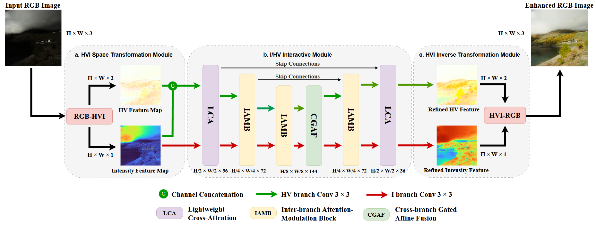
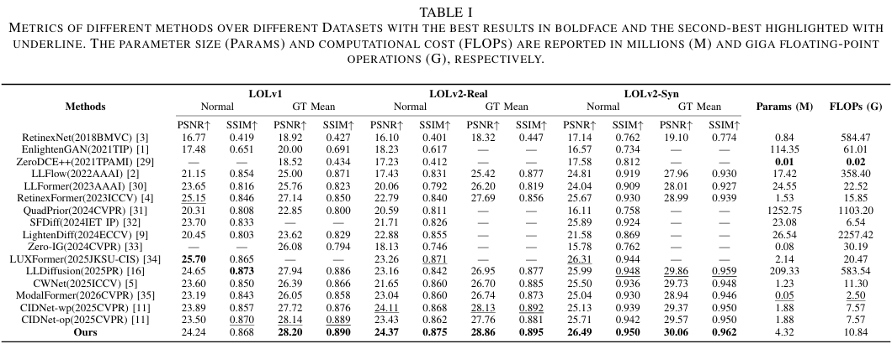
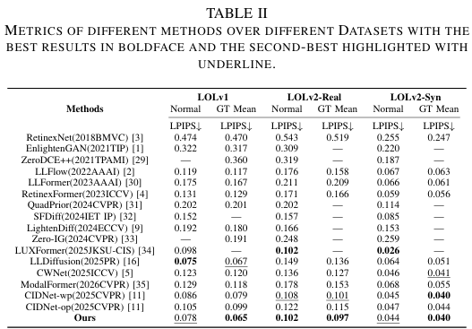
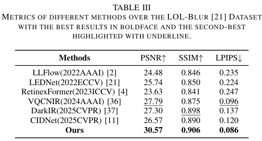
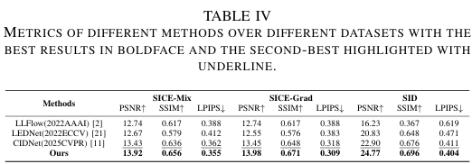
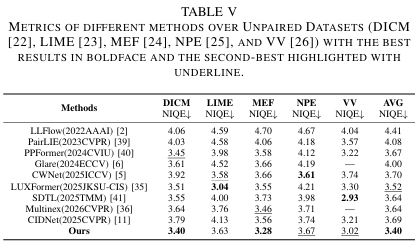
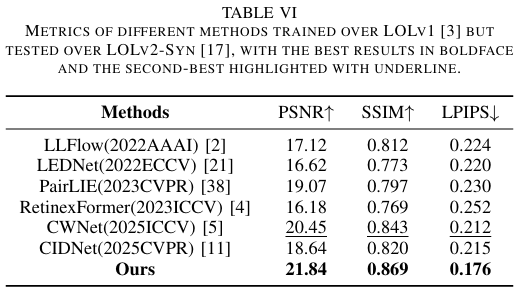
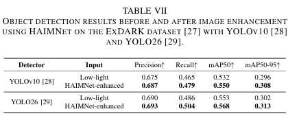
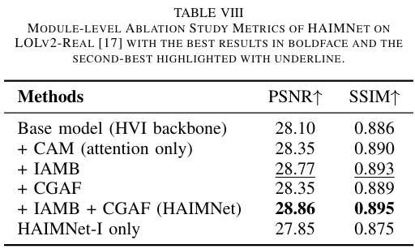
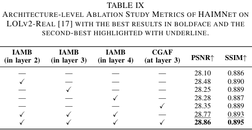

# HAIMNet
[](#) 
[](#)
[](https://pan.baidu.com/s/1tVqnB3tovayq8DZkY0Nzbg?pwd=llzk)
[](#license)

Official implementation of **HAIMNet: A Hierarchical Adaptive Interaction and Modulation Network for Low-Light Image Enhancement**.
<p align="center">
  
</p>

## Overview

HAIMNet is a low-light image enhancement framework designed to restore visually pleasing and detail-preserving images under challenging illumination conditions.

This repository provides the source code, pretrained models, evaluation scripts, and metric computation tools for reproducing the experimental results.

## Results

<details>
<summary>Click to expand experimental results</summary>

### Quantitative Results

<details>
<summary>LOL Series</summary>

<p align="center">
  
</p>

<p align="center">
  
</p>

</details>

<details>
<summary>LOL-Blur</summary>

<p align="center">
  
</p>

</details>

<details>
<summary>SICE / SID</summary>

<p align="center">
  
</p>

</details>

<details>
<summary>Unpaired Datasets</summary>

<p align="center">
  
</p>

</details>

<details>
<summary>Cross-dataset Evaluation</summary>

<p align="center">
  
</p>

</details>

<details>
<summary>Downstream Evaluation</summary>

<p align="center">
  
</p>

</details>

### Ablation Study

<details>
<summary>Ablation 1</summary>

<p align="center">
  
</p>

</details>

<details>
<summary>Ablation 2</summary>

<p align="center">
  
</p>

</details>

</details>


## Getting Started
### Weights
Pretrained weights on different datasets are available at [[Baidu Pan](https://pan.baidu.com/s/1tVqnB3tovayq8DZkY0Nzbg?pwd=llzk)] (code: `llzk`).

Please download the weights and place them in the corresponding directory before running evaluation scripts.

### Create Environment

```bash
conda env create -f environment.yml
```
### Prepare Datasets
Put datasets in the following folder:

<details close> <summary>datasets (click to expand)</summary>

```
├── datasets
	├── DICM
	├── LIME
	├── LOL_blur
	├── LOLv1
	├── LOLv2
		├── Real_captured
		├── Synthetic
	├── MEF
	├── NPE
	├── SICE
		├── Dataset
		├── SICE_Grad
		├── SICE_Mix
		├── SICE_Reshape
	├── Sony_total_dark
	├── VV
```
</details>

## Inference

### Single-image Enhancement

You can try using our model to restore a single image.
```bash
python eval_hf.py
```

### Evaluation on Benchmark Datasets

You can test our method as follows.

```bash
# paired datasets
python eval.py --lol

python eval_SID_blur.py --Blur

# unpaired datasets
python eval.py --unpaired --DICM
```
Other datasets can be evaluated by replacing the dataset-specific arguments accordingly.

## Measure
You can use the code below to test metrics.
```bash
# paired datasets
python measure.py --lol

python measure_SID_blur.py --Blur

# unpaired datasets
python measure_niqe.py --DICM
```
Other datasets can be evaluated by replacing the dataset-specific arguments accordingly.

## Citation
If this work is useful for your research, please cite:
```bash
Citation information will be updated once the paper is officially available.
```

## License
This project is released for academic and research use. Please contact the authors for other usage.

## Acknowledgements
We thank the authors of the public low-light image enhancement datasets and related open-source projects.
